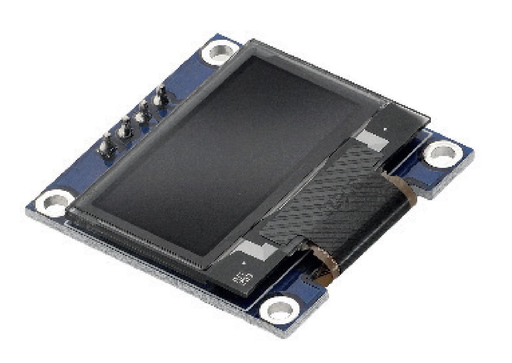

# BLE GasCounter

Ein ESP32-C6-basierter Gaszähler mit BLE-Schnittstelle (Nordic UART Service), WLAN, MQTT, OLED-Display und NeoPixel-LED. Über eine Flutter-Android-App kann der Zähler live ausgelesen und konfiguriert werden.

> **Entwicklungsumgebung einrichten?**
> Alle Schritte zur Installation von arduino-cli, Flutter, Android SDK, ADB und typische Fehler sind dokumentiert in:
> **[dev-context.md](dev-context.md)**

---

## Hardware

| | |
|---|---|
|  |  |
| **ESP32-C6 SuperMini** | **OLED 0.96" I2C (SSD1306, 128×64)** |

### Weitere Komponenten

- Gaszähler mit Reed-Kontakt oder Impulsausgang (1 Impuls = 0,01 m³, konfigurierbar)
- WS2812-NeoPixel (1 LED, Statusanzeige)
- Optional: Taster am BOOT-Pin (GPIO9) zum manuellen Zählerreset

---

## Pinbelegung ESP32-C6 SuperMini

| GPIO | Funktion | Beschreibung |
|------|----------|--------------|
| GPIO0 | OLED SDA | I2C Daten |
| GPIO1 | OLED SCL | I2C Takt |
| GPIO3 | Sensor | Reed-Kontakt / Impulseingang |
| GPIO8 | NeoPixel | WS2812 Datenleitung |
| GPIO9 | BOOT/Taster | Zähler-Reset (BOOT-Taste) |

### Verdrahtung OLED

```
ESP32-C6        OLED SSD1306
--------        ------------
3.3V    ------> VCC
GND     ------> GND
GPIO0   ------> SDA
GPIO1   ------> SCL
```

### Verdrahtung Sensor (Reed-Kontakt)

```
ESP32-C6        Reed-Kontakt
--------        ------------
GPIO3   ------> Kontakt A
GND     ------> Kontakt B
```
(Interner Pull-up aktiv, Kontakt gegen GND)

---

## Projektstruktur

```
ble_gascounter/
├── firmware/               # Arduino-Firmware (ESP32-C6)
│   ├── src/
│   │   └── main.cpp        # Hauptprogramm
│   ├── firmware.ino        # Arduino-Stub
│   ├── sketch.yaml         # arduino-cli Konfiguration
│   └── makefile            # Build & Flash Shortcuts
├── app/                    # Flutter Android-App
│   ├── lib/
│   │   ├── main.dart
│   │   ├── app.dart
│   │   ├── constants/
│   │   │   └── nus_uuids.dart      # BLE NUS Service UUIDs
│   │   ├── models/
│   │   │   └── ble_row.dart        # Gefundenes BLE-Gerät
│   │   ├── services/
│   │   │   └── ble_manager.dart    # BLE-Verbindung & Protokoll
│   │   └── screens/
│   │       ├── home_screen.dart
│   │       ├── scan_connect_screen.dart
│   │       ├── device_screen.dart
│   │       └── config_screen.dart
│   └── android/
│       └── app/src/main/
│           └── AndroidManifest.xml
└── images/
    ├── esp32-c6-supermini.jpg
    └── oled097zoll.jpg
```

---

## Firmware

### Voraussetzungen

- [arduino-cli](https://arduino.github.io/arduino-cli/) >= 1.4
- ESP32 Core 3.3.x (`esp32:esp32`)
- Libraries (global unter `~/Arduino/libraries`):
  - `NimBLE-Arduino` >= 2.x
  - `ArduinoJson` >= 7.x
  - `PubSubClient`
  - `Adafruit SSD1306`
  - `Adafruit GFX Library`
  - `Adafruit NeoPixel`

### Kompilieren & Flashen

```bash
cd firmware

# Nur kompilieren
make build

# Kompilieren und flashen (Port /dev/ttyACM0)
make flash

# Seriellen Monitor öffnen
make monitor
```

### FQBN (Board-Konfiguration)

```
esp32:esp32:esp32c6:UploadSpeed=921600,CDCOnBoot=cdc,CPUFreq=160,
FlashFreq=80,FlashMode=qio,FlashSize=4M,PartitionScheme=huge_app,
DebugLevel=none,EraseFlash=none
```

> **Hinweis:** `PartitionScheme=huge_app` ist zwingend erforderlich, da BLE + WLAN zusammen zu groß für das Standard-Partition-Schema sind (~44% Flash-Auslastung bei `huge_app`).

---

## BLE-Protokoll (Nordic UART Service / NUS)

Das Gerät advertised als `GasCounter-XXXX` (XXXX = letzte 2 Bytes der MAC-Adresse).

### NUS UUIDs

| Rolle | UUID |
|-------|------|
| Service | `6e400001-b5a3-f393-e0a9-e50e24dcca9e` |
| RX (App → Gerät) | `6e400002-b5a3-f393-e0a9-e50e24dcca9e` |
| TX (Gerät → App) | `6e400003-b5a3-f393-e0a9-e50e24dcca9e` |

### Kommandos (App → Gerät, JSON über RX)

#### Zustand abfragen

```json
{"cmd": "get_state"}
```

Antwort:

```json
{
  "type": "state",
  "total_kwh": 123.456,
  "hour_kwh": 0.012,
  "pulses_total": 12345,
  "pulses_hour": 1,
  "rssi": -65,
  "mqtt": true
}
```

#### Konfiguration abfragen

```json
{"cmd": "get_config"}
```

Antwort:

```json
{
  "type": "config",
  "ssid": "MeinWLAN",
  "mqtt_host": "192.168.1.16",
  "pulse_vol": 0.01,
  "kwh_m3": 10.5
}
```

#### Konfiguration setzen

```json
{
  "cmd": "set_config",
  "ssid": "MeinWLAN",
  "pass": "geheim",
  "mqtt_host": "192.168.1.16",
  "pulse_vol": 0.01,
  "kwh_m3": 10.5
}
```

Alle Felder optional — nur gesendete Felder werden überschrieben. Nach erfolgreichem Speichern startet das Gerät automatisch neu.

#### Impulszähler zurücksetzen

```json
{"cmd": "reset"}
```

Setzt `total_kwh`, `hour_kwh`, `pulses_total` und `pulses_hour` auf 0.

#### Gerät neu starten

```json
{"cmd": "reboot"}
```

### Acknowledgement (Gerät → App)

Auf alle Schreibkommandos antwortet das Gerät mit:

```json
{"ack": true, "cmd": "set_config"}
```

Bei Fehler:

```json
{"ack": false, "cmd": "set_config", "error": "Fehlerbeschreibung"}
```

---

## MQTT

Das Gerät veröffentlicht seinen Zustand automatisch nach jeder Stunde und bei WLAN-Verbindungsaufbau.

| Topic | Beschreibung |
|-------|--------------|
| `gas_counter/state` | JSON mit Messwerten (total_kwh, hour_kwh, pulses) |
| `gas_counter/gpio2` | GPIO2-Zustand (Rohwert) |
| `gas_counter/availability` | `online` / `offline` (Last Will) |

**Standard-Broker:** `192.168.1.16:1883`
**Client-ID:** `gas_counter_esp32c6`

---

## NVS-Konfiguration (Flash-Speicher)

Alle Einstellungen werden im NVS (Non-Volatile Storage) gespeichert und überleben Neustarts:

| Schlüssel | Typ | Standard | Beschreibung |
|-----------|-----|----------|--------------|
| `wifi_ssid` | String | – | WLAN-SSID |
| `wifi_pass` | String | – | WLAN-Passwort |
| `mqtt_host` | String | `192.168.1.16` | MQTT-Broker IP/Hostname |
| `pulse_vol` | Float | `0.01` | m³ pro Impuls |
| `kwh_m3` | Float | `10.5` | kWh pro m³ |
| `total_mWh` | UInt | `0` | Gesamt-Energiezähler (in mWh) |

---

## NeoPixel Statusanzeige

| Farbe | Bedeutung |
|-------|-----------|
| Blau blinkend | BLE-Verbindung aktiv |
| Grün | WLAN + MQTT verbunden |
| Gelb | WLAN verbunden, MQTT getrennt |
| Rot | Kein WLAN |
| Weiss kurz | Impuls empfangen |

---

## Flutter App (Android)

### Voraussetzungen

- Flutter >= 3.41
- Android SDK >= 36
- Java 17 (für Gradle)

### Abhängigkeiten

```yaml
dependencies:
  flutter_blue_plus: ^1.31.17
  permission_handler: ^11.3.1
dependency_overrides:
  flutter_blue_plus_android: 1.35.0
```

### APK bauen

```bash
cd app
flutter pub get
flutter build apk --release
# APK: build/app/outputs/flutter-apk/app-release.apk
```

### APK installieren (USB)

```bash
adb install build/app/outputs/flutter-apk/app-release.apk
```

### Android-Berechtigungen

Die App benötigt folgende Berechtigungen (werden beim ersten Start abgefragt):

- `BLUETOOTH_SCAN` — BLE-Scan
- `BLUETOOTH_CONNECT` — BLE-Verbindung
- `ACCESS_FINE_LOCATION` — Pflicht für BLE-Scan unter Android

> **Wichtig:** Unter Android muss der **Standortdienst systemweit eingeschaltet** sein (nicht nur die App-Berechtigung), damit BLE-Scans Ergebnisse liefern.

### App-Screens

#### Home

Drei Kacheln als Einstiegspunkt: Scan/Verbinden/Trennen, Messwerte, Konfiguration.

#### Scan · Verbinden · Trennen

Scannt nach Geräten die den NUS-Service (`6e400001-...`) advertisen. Zeigt Gerätename, MAC-Adresse und RSSI. Verbundenes Gerät wird unten angezeigt. Nach erfolgreicher Verbindung kehrt die App automatisch zur Hauptseite zurück.

#### Messwerte

Zeigt live:
- Gesamt-kWh (groß)
- Diese Stunde kWh
- Impulse gesamt / diese Stunde
- RSSI der WLAN-Verbindung
- MQTT-Verbindungsstatus

Aktionen: Werte abrufen, Konfiguration öffnen, Zähler zurücksetzen (mit Bestätigungsdialog), Verbindung trennen.

#### Konfiguration

- WLAN-SSID und Passwort
- MQTT-Broker Host/IP
- Kalibrierung: m³/Impuls und kWh/m³
- Konfiguration lesen (Icon oben rechts)
- Speichern & Senden (löst automatischen Neustart aus)
- Zähler zurücksetzen
- Gerät neu starten

---

## Schnellstart

1. Hardware verdrahten (OLED an GPIO0/1, Sensor an GPIO3)
2. Firmware flashen: `cd firmware && make flash`
3. Beim ersten Start startet das Gerät ohne WLAN — BLE ist sofort aktiv
4. App installieren und öffnen
5. "Scan · Verbinden · Trennen" → Gerät auswählen → "Verbinden"
6. "Konfiguration" → WLAN-Daten und MQTT-Broker eintragen → "Speichern & Senden"
7. Gerät startet neu, verbindet sich mit WLAN und MQTT
8. Ab sofort werden Messwerte per MQTT gesendet und sind über BLE abrufbar

---

## Lizenz

MIT License — frei verwendbar und veränderbar.
